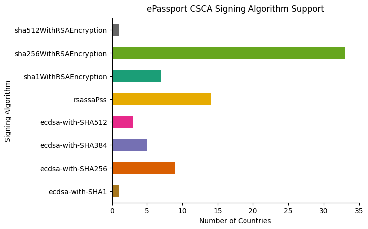

# Circuit Architecture

The whole verification process does not fit into one circuit.

Some variations exist between documents. I will try to list them below:

- Date of birth is at a different place in TD1, TD2 and TD3, as well as their different total sizes.
- Different documents may choose different hashing algorithms, therefore the verification of `DG1 -> LDS -> SignedAttrs` needs to be implemented in their own circuits.
- Different documents may choose different (hash+sign) algorithm pairs, for the signing step.
- Public key verification from certificates is another variation layer.

Therefore, we propose splitting the circuits into basically three layers:

1. `DG1 -> LDS -> SignedAttrs` for each hashing algorithm for each document type. Three types of documents needs to unroll here, since the input sizes are different from each other. There will be `3 * hash_algo` ZkPrograms here.
2. **Signature**: This deserves its own layer since it is so expensive.
3. **Certificate**: This part is an unknown at the moment.

We will also integrate `mina-credentials` project in order for users to claim certain constraints, which is the whole point of the zkPassport, a bit unknown at the moment.

<figure>
 
 <figcaption>Excellent analysis from OpenPassport team</figcaption>
</figure>

The image above is outlining only the `hash+sign` algorithm pair variation across countries.
