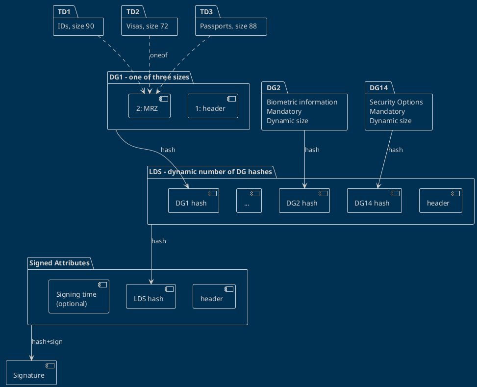

# Grokking eMRTDs

Let us logically understand how does a document is created, layer by layer.



### DG1

DG1 header is 5 bytes, MRZ can be one of three sizes, depending on the document type.

Some MRZ examples below.

TD1: IDs, size 90

```
I<GBRP231458901<<<<<<<<<<<<<<<
6709224M2209151GBR<<<<<<<<<<<6
BAGGINS<<FRODO<<<<<<<<<<<<<<<<
```

TD2: Visas, size: 72

```
I<GBRBAGGINS<<FRODO<<<<<<<<<<<<<<<<<
P231458901GBR6709224M2209151<<<<<<<6
```

TD3: Passports - size: 88

```
P<GBRBAGGINS<<FRODO<<<<<<<<<<<<<<<<<<<<<<<<<
P231458901GBR6709224M2209151ZE184226B<<<<<18
```

### LDS - Logical Data Structure

This structure holds the list of data group hashes the document contains.

- The list is ordered
- Datagroups 1, 2 and 14 are mandatory
- A document can have up to 16 datagroups
- LDS header is 29 or 30 bytes, depending on the hash algorithm used. This is because the algorithm OIDs are of different length, in the header.
- Datagroup hashes are naturally the size of the hash algorithm output size.

Therefore, LDS size can be deduced by knowing the digest algorithm. Then, depending on the number of datagroups present, it can only be one of 14 different lengths.

The DG1 is always at the head, so at compile time we know the offset of DG1 hash, depending on the hashing algorithm.

### Signed Attributes

The header is fixed length, therefore LDS hash offset is fixed for all documents.

The third component is optional.

### Signature

The Signed Attributes payload is then hashed and signed by the issuer.

The hash algorithm used in signing can be different from the hashing algorithm used everywhere else.

The issuers use a big number of keys, so they create certificates to verify them against a much smaller set of public keys later.
